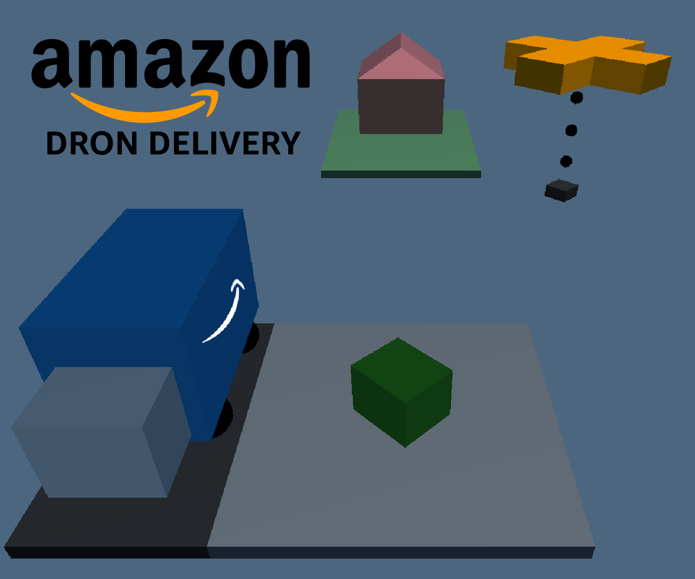

# SimulacionFisicaVideojuegos : Proyecto Final

# Amazon Dron Delivery

## Descripción

En Amazon Dron Delivery (ADD) encarnas a un repartidor de amazon en su primer dia como piloto de drones. Tendrás la labor de repartir todos los paquetes necesarios en el menor tiempo posible y ,a ser posible, evitando perder alguno por el camino.

## Controles
Para obtener este objetivo podremos desplazar el dron en el plano xz cambiando su vector de movimiento con nuestro input y mover arriba y abajo el iman que usaremos para enganchar los paquetes acortando o alargando el cable que lo une al dron.

|         Tecla  |Accion                          | Explicación |
|----------------|-------------------------------|-|
|W A S D|`'Control del movimiento del dron'`            |Añade movimiento al dron en la dirección pulsada|
|Q E          |`'Subir y bajar el iman'`            |Añade movimiento al punto de anclaje del iman|
|Espacio|`Detener por completo el dron y el iman`|Establece todos los movimientos a cero|

```